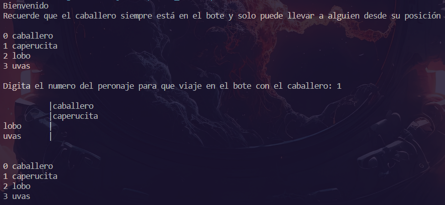
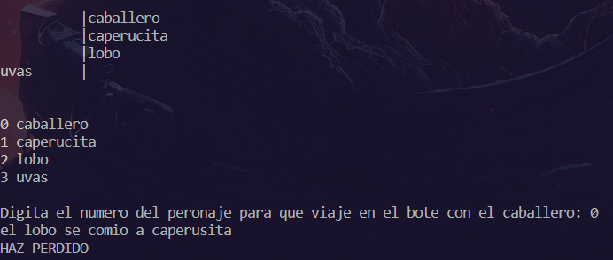
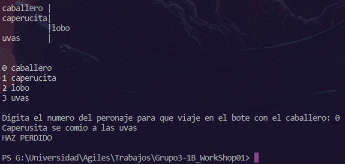
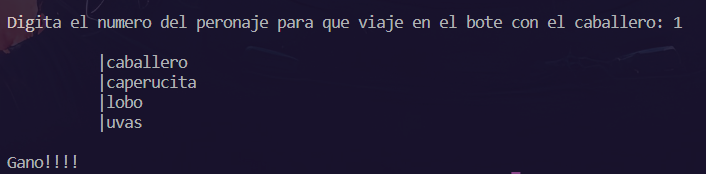

# Criterios de aceptación
## Criterio 01: El programa debe ser interactivo
### Captura

### Resultado
- Aceptado
## Criterio 02: El programa debe impedir dejar en un solo lado al lobo y caperucita
### Captura

### Resultado
- Aceptado
## Criterio 03: El programa debe impedir dejar en un solo lado a la caperucita y las uvas
### Captura

### Resultado
- Aceptado
## Criterio 04: El programa debe cumplir con la solución del puzzle
### Captura

### Resultado
- Aceptado

## Evidencia de la ejecución por el cliente
### Captura
