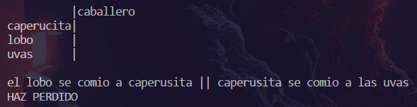

# Resutado de pruebas unitarias
## Prueba Unitaria 01: Se realizó la prueba sin ningún incoveniente
### Captura

### Resultado
- Aceptado
## Prueba Unitaria 02: Se realizó la prueba sin ningún incoveniente
### Captura

### Resultado
- Aceptado
## Prueba Unitaria 03: Se realizó la prueba sin ningún incoveniente
### Captura

### Resultado
- Aceptado   
## Evidencia
### Captura
